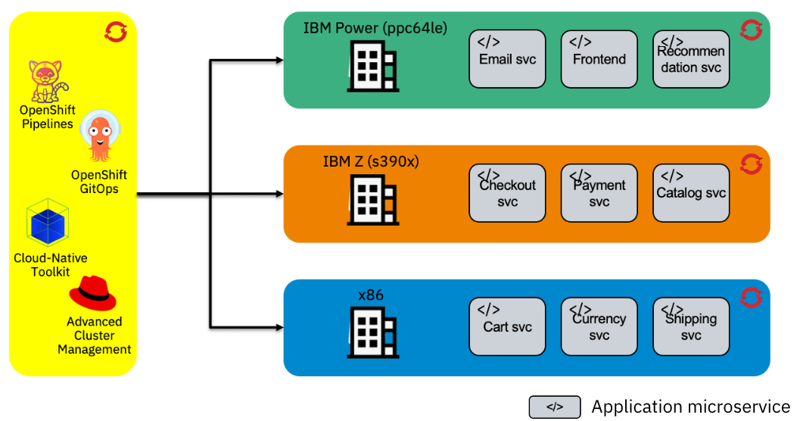

# OpenShift multiarchitecture build using Tekton - Demo setup

<!-- TODO Change the repo to the IBM org -->


This Terraform script is an automated setup for building multiarchitectures images using Tekton on different OpenShift clusters.

The pipelines used are under the repository : https://github.com/aminerachyd/ibm-garage-tekton-tasks/tree/multiarch-pipeline

The multiarchitecture pipelines build images for x86, IBM Z (s390x) and IBM Power (ppc64le) architectures.

This script uses a setup script to configure clusters in order to produce multiarchitecture images, then launches Tekton pipelines to build and deploy the applications using ArgoCD.

## Prerequisites :

- Install [Terraform CLI](https://www.terraform.io/downloads.html)
- Admin access to two x86 clusters, a Z cluster and a Power cluster
- One x86 cluster is used as a "development cluster", the [Cloud-Native Toolkit](https://cloudnativetoolkit.dev/) aswell as [ArgoCD](https://argo-cd.readthedocs.io/en/stable/) should be installed on this cluster.
  You can install ArgoCD using the OpenShift operator : Red Hat OpenShift GitOps
  The other clusters will be used as "workload clusters" to build images in the corresponding architectures and deploy them later on with ArgoCD via a GitOps repository that is also being created by the script.
- [Red Hat Advanced Cluster Management](https://www.redhat.com/en/technologies/management/advanced-cluster-management) managing the workload clusters with the [Submariner add-on](https://submariner.io) installed on them to enable inter-cluster communication.

## Customizable variables :

| Variable              | Description                                                                                                                                                                                                                                                                                                                                                                                                                              | Default value                                              | Type   |
| --------------------- | ---------------------------------------------------------------------------------------------------------------------------------------------------------------------------------------------------------------------------------------------------------------------------------------------------------------------------------------------------------------------------------------------------------------------------------------- | ---------------------------------------------------------- | ------ |
| project-name          | Name of the project you want to create. The script will generate a project named `<project-name>-dev` on the development cluster in which you can run your pipelines. The script will create on each workload cluster 3 projects : `<project-name>-dev`, `<project-name>-test` and `<project-name>-prod`, the first for running a remote pipeline, and the other two for deploying the applications in test and production environments. | -                                                          | string |
| dev-cluster-host      | API server for the development cluster. This cluster must be an x86 cluster with the Cloud-Native Toolkit installed.                                                                                                                                                                                                                                                                                                                     | -                                                          | string |
| x86-cluster-host      | API server for the x86 workload cluster. This cluster will be used for running a remote pipeline.                                                                                                                                                                                                                                                                                                                                        | -                                                          | string |
| power-cluster-host    | API server for the Power workload cluster. This cluster will be used for running a remote pipeline.                                                                                                                                                                                                                                                                                                                                      | -                                                          | string |
| z-cluster-host        | API server for the Z workload cluster. This cluster will be used for running a remote pipeline.                                                                                                                                                                                                                                                                                                                                          | -                                                          | string |
| dev-cluster-token     | Token for the development cluster. Access should be cluster admin.                                                                                                                                                                                                                                                                                                                                                                       | -                                                          | string |
| x86-cluster-token     | Token for the x86 workload cluster. Access should be cluster admin.                                                                                                                                                                                                                                                                                                                                                                      | -                                                          | string |
| power-cluster-token   | Token for the power workload cluster. Access should be cluster admin.                                                                                                                                                                                                                                                                                                                                                                    | -                                                          | string |
| z-cluster-token       | Token for the z workload cluster. Access should be cluster admin.                                                                                                                                                                                                                                                                                                                                                                        | -                                                          | string |
| image-namespace       | Namespace of the image registry (user or organization).                                                                                                                                                                                                                                                                                                                                                                                  | -                                                          | string |
| image-server          | Hostname of the image registry server.                                                                                                                                                                                                                                                                                                                                                                                                   | quay.io                                                    | string |
| registry-user         | Username for the image registry to be used by the pipelines, will be stored in a secret `docker-registry-access` on all dev projects on all clusters.                                                                                                                                                                                                                                                                                    | -                                                          | string |
| registry-token        | Access token for the image registry to be used by the pipelines, will be stored in a secret `docker-registry-access` on all dev projects on all clusters.                                                                                                                                                                                                                                                                                | -                                                          | string |
| github-user           | Github user for creating the GitOps repository.                                                                                                                                                                                                                                                                                                                                                                                          | -                                                          | string |
| github-org            | Github organization for creating the GitOps repository,could be the same as the github-user.                                                                                                                                                                                                                                                                                                                                             | -                                                          | string |
| github-token          | Github token for creating the GitOps repository, needs to have access to repository deletion in order to delete the repo when destroying the Terraform project. Used also for accessing the Github microservices repositories to create webhooks.                                                                                                                                                                                        | -                                                          | string |
| smee-client           | Smee client url for event listening, head over the smee.io. Your git repos should have webhooks configured for this url. This is only used because the clusters used in the demo are not accessible without a VPN. The default value is the URL configured for the repositories webhooks. If you're using the default repositories, don't change this.                                                                                   | https://smee.io/1z0sn0jELNsxNcia                           | string |
| frontendservice       | Git repo for the frontend microservice.                                                                                                                                                                                                                                                                                                                                                                                                  | https://github.com/ibm-ecosystem-lab/frontend              | string |
| productcatalogservice | Git repo for the product catalog microservice.                                                                                                                                                                                                                                                                                                                                                                                           | https://github.com/ibm-ecosystem-lab/productcatalogservice | string |
| cartservice           | Git repo for the cart microservice.                                                                                                                                                                                                                                                                                                                                                                                                      | https://github.com/ibm-ecosystem-lab/cartservice           | string |
| shippingservice       | Git repo for the shipping microservice.                                                                                                                                                                                                                                                                                                                                                                                                  | https://github.com/ibm-ecosystem-lab/shippingservice       | string |
| checkoutservice       | Git repo for the checkout microservice.                                                                                                                                                                                                                                                                                                                                                                                                  | https://github.com/ibm-ecosystem-lab/checkoutservice       | string |
| recommendationservice | Git repo for the recommendation microservice.                                                                                                                                                                                                                                                                                                                                                                                            | https://github.com/ibm-ecosystem-lab/recommendationservice | string |
| paymentservice        | Git repo for the payment microservice.                                                                                                                                                                                                                                                                                                                                                                                                   | https://github.com/ibm-ecosystem-lab/paymentservice        | string |
| emailservice          | Git repo for the email microservice.                                                                                                                                                                                                                                                                                                                                                                                                     | https://github.com/ibm-ecosystem-lab/emailservice          | string |
| currencyservice       | Git repo for the currency microservice.                                                                                                                                                                                                                                                                                                                                                                                                  | https://github.com/ibm-ecosystem-lab/currencyservice       | string |

## Deploy with Terraform

1. Clone github repository

   ```bash
   git clone https://github.com/ibm-ecosystem-lab/multiarch-build-demo-setup
   ```

2. Create your `variables.tfvars` variables file

3. Deploy with terraform

   ```bash
   terraform init
   terraform plan
   terraform apply
   ```

## Application architecture

The deployed application will be following this architecture:


The services are distributed on all the clusters and can communicate with each other using the Submariner add-on. They are deployed with a GitOps strategy, the GitOps repo is created with the script using the `github-user` and `github-token` variables. ArgoCD will try to deploy the services according to what is listed on the GitOps repo. Services placement can also be altered on ArgoCD, either before the deployment on the Terraform script or after the deployment using the ArgoCD UI/CLI.
